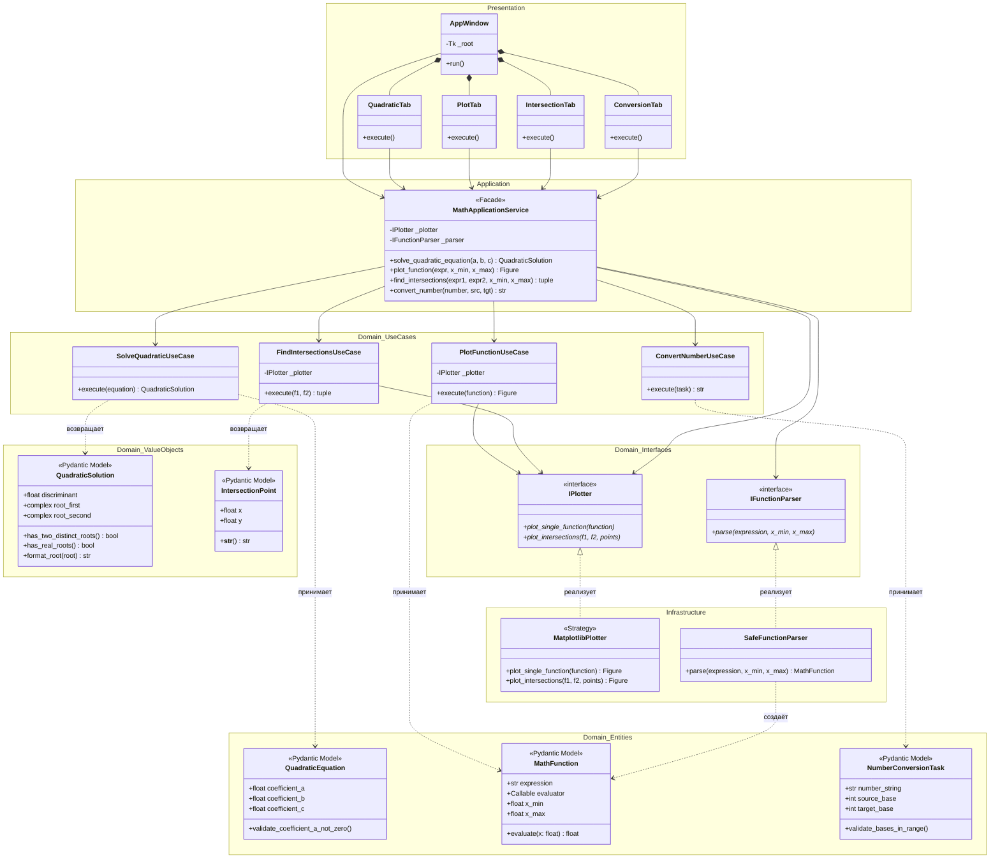

## UML-диаграмма классов

```mermaid
classDiagram
    direction TB

    %% ─── DOMAIN: Entities ───────────────────────────────────────
    namespace Domain_Entities {
        class QuadraticEquation {
            <<Pydantic Model>>
            +float coefficient_a
            +float coefficient_b
            +float coefficient_c
            +validate_coefficient_a_not_zero()
        }

        class MathFunction {
            <<Pydantic Model>>
            +str expression
            +Callable evaluator
            +float x_min
            +float x_max
            +evaluate(x: float) float
        }

        class NumberConversionTask {
            <<Pydantic Model>>
            +str number_string
            +int source_base
            +int target_base
            +validate_bases_in_range()
        }
    }

    %% ─── DOMAIN: Value Objects ──────────────────────────────────
    namespace Domain_ValueObjects {
        class QuadraticSolution {
            <<Pydantic Model>>
            +float discriminant
            +complex root_first
            +complex root_second
            +has_two_distinct_roots() bool
            +has_real_roots() bool
            +format_root(root) str
        }

        class IntersectionPoint {
            <<Pydantic Model>>
            +float x
            +float y
            +__str__() str
        }
    }

    %% ─── DOMAIN: Interfaces ─────────────────────────────────────
    namespace Domain_Interfaces {
        class IPlotter {
            <<interface>>
            +plot_single_function(function)*
            +plot_intersections(f1, f2, points)*
        }

        class IFunctionParser {
            <<interface>>
            +parse(expression, x_min, x_max)*
        }
    }

    %% ─── DOMAIN: Use Cases ──────────────────────────────────────
    namespace Domain_UseCases {
        class SolveQuadraticUseCase {
            +execute(equation) QuadraticSolution
        }

        class PlotFunctionUseCase {
            -IPlotter _plotter
            +execute(function) Figure
        }

        class FindIntersectionsUseCase {
            -IPlotter _plotter
            +execute(f1, f2) tuple
        }

        class ConvertNumberUseCase {
            +execute(task) str
        }
    }

    %% ─── APPLICATION ────────────────────────────────────────────
    namespace Application {
        class MathApplicationService {
            <<Facade>>
            -IPlotter _plotter
            -IFunctionParser _parser
            +solve_quadratic_equation(a, b, c) QuadraticSolution
            +plot_function(expr, x_min, x_max) Figure
            +find_intersections(expr1, expr2, x_min, x_max) tuple
            +convert_number(number, src, tgt) str
        }
    }

    %% ─── INFRASTRUCTURE ─────────────────────────────────────────
    namespace Infrastructure {
        class MatplotlibPlotter {
            <<Strategy>>
            +plot_single_function(function) Figure
            +plot_intersections(f1, f2, points) Figure
        }

        class SafeFunctionParser {
            +parse(expression, x_min, x_max) MathFunction
        }
    }

    %% ─── PRESENTATION ───────────────────────────────────────────
    namespace Presentation {
        class AppWindow {
            -Tk _root
            +run()
        }

        class QuadraticTab {
            +execute()
        }

        class PlotTab {
            +execute()
        }

        class IntersectionTab {
            +execute()
        }

        class ConversionTab {
            +execute()
        }
    }

    %% ─── Наследование ───────────────────────────────────────────
    IPlotter <|.. MatplotlibPlotter : реализует
    IFunctionParser <|.. SafeFunctionParser : реализует

    %% ─── Зависимости use cases ──────────────────────────────────
    PlotFunctionUseCase --> IPlotter
    FindIntersectionsUseCase --> IPlotter

    %% ─── Сервис использует use cases ────────────────────────────
    MathApplicationService --> SolveQuadraticUseCase
    MathApplicationService --> PlotFunctionUseCase
    MathApplicationService --> FindIntersectionsUseCase
    MathApplicationService --> ConvertNumberUseCase
    MathApplicationService --> IPlotter
    MathApplicationService --> IFunctionParser

    %% ─── Use cases работают с доменными объектами ───────────────
    SolveQuadraticUseCase ..> QuadraticEquation : принимает
    SolveQuadraticUseCase ..> QuadraticSolution : возвращает
    FindIntersectionsUseCase ..> IntersectionPoint : возвращает
    ConvertNumberUseCase ..> NumberConversionTask : принимает
    PlotFunctionUseCase ..> MathFunction : принимает
    SafeFunctionParser ..> MathFunction : создаёт

    %% ─── GUI использует сервис ──────────────────────────────────
    AppWindow --> MathApplicationService
    QuadraticTab --> MathApplicationService
    PlotTab --> MathApplicationService
    IntersectionTab --> MathApplicationService
    ConversionTab --> MathApplicationService
    AppWindow *-- QuadraticTab
    AppWindow *-- PlotTab
    AppWindow *-- IntersectionTab
    AppWindow *-- ConversionTab
```
